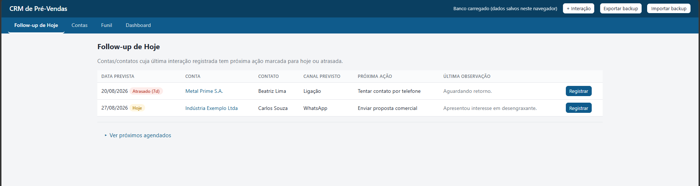
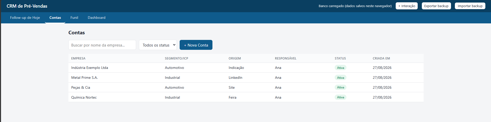
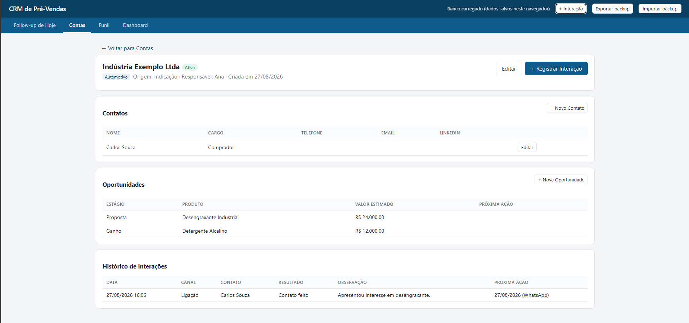
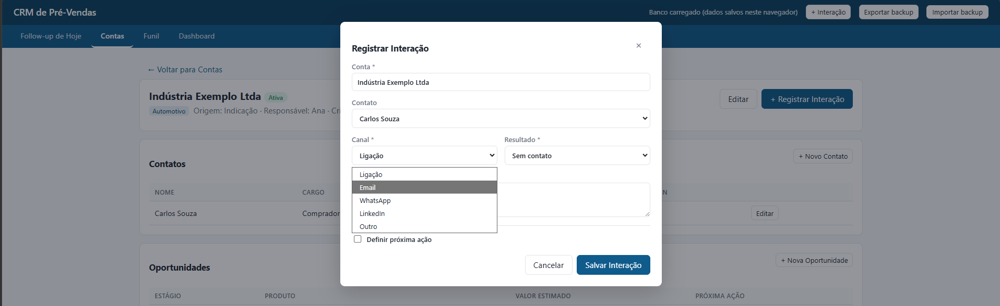
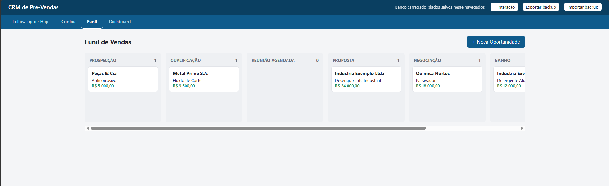
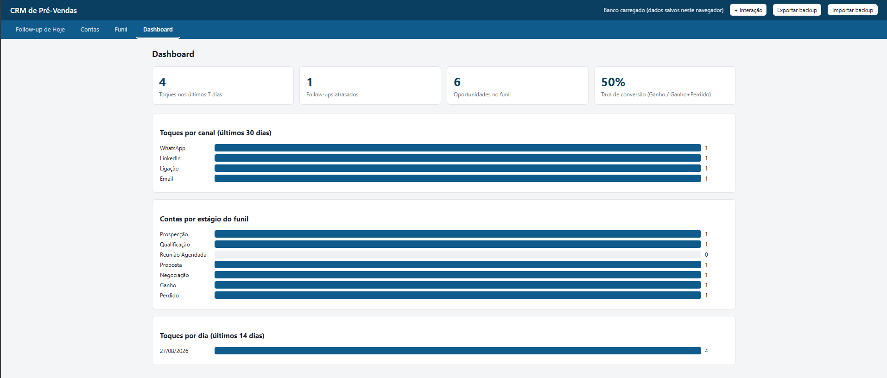

# CRM de Pré-Vendas (SDR)

CRM leve para controle de prospecção outbound: registro de interações por canal, follow-up manual, funil em kanban e um dashboard de KPIs — tudo rodando **inteiramente no navegador**, sem backend, sem instalação e sem custo de hospedagem.

Feito para o cenário de um SDR/pré-vendas com acesso limitado ao CRM oficial da empresa (ex: Salesforce) e que precisa de uma ferramenta pessoal simples para não depender de planilha.

## Por que é diferente de "só uma planilha"

- **Funil de verdade** (kanban com drag-and-drop) em vez de linhas soltas numa aba.
- **Follow-up sem cadência automática**: cada interação pode gerar uma próxima ação (data + canal + observação) definida manualmente — o sistema só *lista* o que está atrasado ou vence hoje, sem inventar regra de "toque a cada X dias".
- **Histórico estruturado por conta/contato**, com relação real entre contas, contatos, interações e oportunidades (chaves estrangeiras, não texto livre).
- **KPIs calculados on-the-fly** a partir dos dados reais (toques por canal/dia, conversão por estágio, follow-ups atrasados).

## Stack técnica

| Camada | Tecnologia | Observação |
|---|---|---|
| Banco de dados | [SQLite](https://sqlite.org) via [sql.js](https://sql.js.org) (WebAssembly) | Roda dentro do navegador, zero servidor |
| Persistência | IndexedDB do navegador | Salva automaticamente a cada alteração |
| Frontend | HTML + CSS + JavaScript puro | Sem framework, sem build step, sem `npm install` |
| Backup | Exportação/importação de arquivo `.db` (SQLite real) | Portabilidade e proteção contra perda de dados |

Sem dependências externas em tempo de execução: a biblioteca sql.js é vendorizada localmente (`js/lib/`), incluindo o binário WebAssembly embutido como base64 — isso evita que o navegador precise dar `fetch()` num arquivo `.wasm` separado, o que o Chrome/Edge bloqueia quando a página é aberta diretamente via `file://` (sem servidor). É esse detalhe que permite abrir o app com duplo clique e ele simplesmente funcionar, 100% offline.

## Funcionalidades

- **Follow-up de Hoje** — lista contas/contatos cuja última interação registrada tem próxima ação vencendo hoje ou atrasada.
- **Contas** — cadastro de contas e, dentro de cada uma, seus contatos, histórico de interações e oportunidades vinculadas.
- **Registro de interação** — poucos cliques: conta, canal (ligação/email/WhatsApp/LinkedIn/outro), resultado, observação, e opcionalmente a próxima ação.
- **Funil** — kanban por estágio (Prospecção → Qualificação → Reunião Agendada → Proposta → Negociação → Ganho/Perdido) com atualização por drag-and-drop.
- **Dashboard** — toques por dia/canal, distribuição de oportunidades por estágio, taxa de conversão, follow-ups atrasados.
- **Backup manual** — exporta/importa um arquivo `.db` (SQLite) para segurança e portabilidade entre dispositivos.

## Capturas de tela

*Dados fictícios, apenas para demonstração.*

**Follow-up de Hoje** — o que está atrasado ou vence hoje, direto ao ponto:



**Contas** — lista com busca e filtro por status:



**Detalhe da conta** — contatos, oportunidades e histórico de interações num só lugar:



**Registro rápido de interação** — poucos campos, próxima ação opcional:



**Funil** — kanban por estágio, arrastar e soltar:



**Dashboard** — KPIs de atividade e conversão:



## Como rodar

Não precisa instalar nada. Dê duplo clique em [`index.html`](index.html) — abre no navegador padrão e já funciona offline.

> Alternativamente, para desenvolvimento, qualquer servidor estático funciona (ex: `npx serve .`), mas isso **não é necessário** para uso normal.

## Estrutura do projeto

```
.
├── index.html                 shell da aplicação e carregamento dos scripts
├── css/
│   └── style.css               estilos
├── js/
│   ├── main.js                  roteamento entre telas (SPA simples, sem framework)
│   ├── db.js                     schema SQL, persistência (IndexedDB) e acesso a dados (Repo.*)
│   ├── util.js                    formatação de datas, canais, dinheiro, helpers de DOM
│   ├── modal.js                    modal e toast genéricos, reutilizados por todas as telas
│   ├── lib/
│   │   ├── sql-wasm.js              build do sql.js (SQLite compilado para WebAssembly)
│   │   └── sql-wasm-data.js          binário .wasm acima, embutido como base64 (ver nota técnica)
│   └── views/
│       ├── followup.js               tela "Follow-up de Hoje"
│       ├── accounts.js                contas + contatos (lista, detalhe, formulários)
│       ├── interactions.js             modal de registro rápido de interação
│       ├── funnel.js                    kanban de oportunidades (drag-and-drop)
│       └── dashboard.js                  KPIs de atividade e conversão
└── README.md
```

Sem build step: qualquer edição em `.js`/`.css` já reflete ao recarregar a página.

## Modelo de dados

```
contas (1) ──< contatos (N)
contas (1) ──< interacoes (N) >── contatos (0..1)
contas (1) ──< oportunidades (N)
```

- **contas**: `nome_empresa`, `segmento_icp`, `origem_lead`, `responsavel`, `status_geral`
- **contatos**: `nome`, `cargo`, `telefone`, `email`, `linkedin_url`
- **interacoes**: `canal`, `resultado`, `observacao`, e opcionalmente `data_proxima_acao` / `canal_proxima_acao` / `observacao_proxima_acao`
- **oportunidades**: `estagio`, `produto_interesse`, `valor_estimado`, `data_proxima_acao`

A tela de Follow-up é uma *view* derivada: para cada par (conta, contato), pega a interação mais recente e verifica se a próxima ação definida nela já venceu.

## Limitações conhecidas (por desenho)

- **Uso pessoal, um dispositivo por vez.** Os dados ficam no IndexedDB do navegador, vinculados ao caminho exato do arquivo `index.html` — não sincronizam entre dispositivos nem entre múltiplos usuários simultâneos. Ver seção de backup para mover dados entre máquinas.
- **Não mova/renomeie a pasta do projeto** depois de começar a usar — isso muda a origem do armazenamento local e o navegador não encontra mais os dados antigos (o backup `.db` existe justamente para esse cenário).
- Importar um backup **substitui** todos os dados atuais — não faz merge com o que já existe.

## Roadmap possível

- [ ] Exportação para `.xlsx` (relatório/compartilhamento, mantendo o SQLite como fonte de verdade)
- [ ] Importação de dados de planilha existente
- [ ] Sincronização multi-dispositivo (exigiria um backend/banco compartilhado)

## Licença

MIT — veja [LICENSE](LICENSE).
